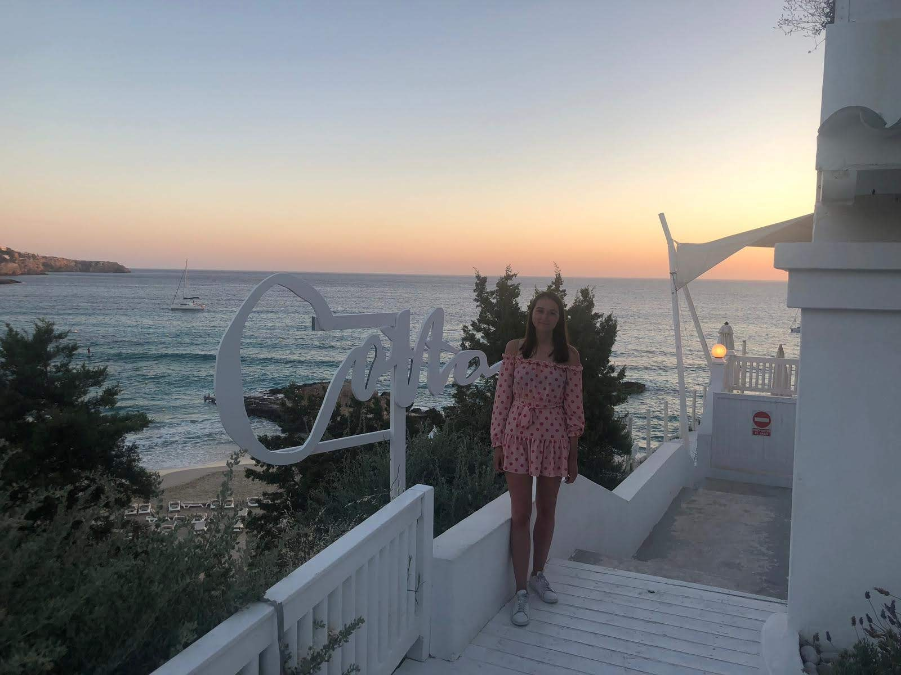

*– This blog uses affiliate links –*  

My name is Miss Shoe, and I'm a UK based blogger who loves to travel. I travel with my family - including my nieces, who are both under the age of 3 (so we have the inside scoop on which hotels are family friendly!)  

We spend a lot of our time exploring everything the UK has to offer, but we also regularly escape for weekend breaks and short getaways, as well as making time for those all-important main holidays!  

### Here at Miss Shoe Stays you’ll find stories on:
* UK day trips
* Mini-breaks, weekends away and road trips
* Family-friendliness reviews
* Hotel, restaurant and attraction reviews
* Travel lifestyle, tips and advice

# The Miss Shoe team
## Editor and co-founder, Miss Shoe

<figure>
  
  <figcaption>
    Cotton Club, Ibiza
  </figcaption>
</figure>

## Co-founder and photographer, Charlotte

<figure>
  
  <figcaption>
    Belmond Le Manoir aux Quat’Saisons, Oxford 
  </figcaption>
</figure>

## Co-founder, Will

<figure>
  
  <figcaption>
    Kerið, Iceland
  </figcaption>
</figure>

